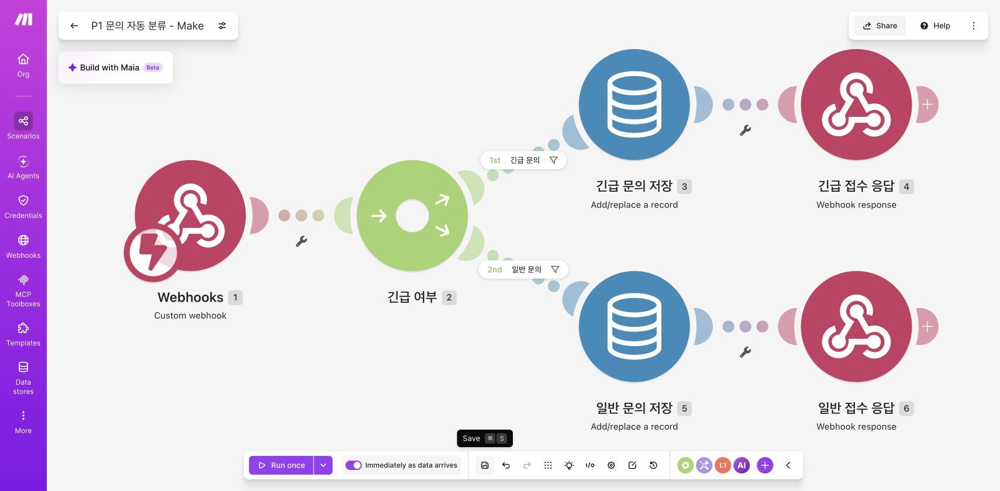
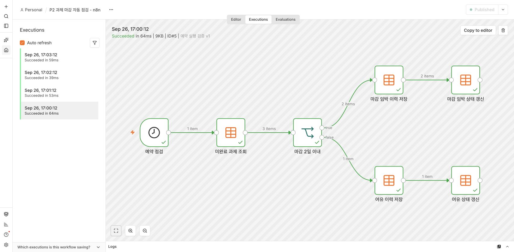

# 노코드 자동화 기초: 워크플로우 설계

Make와 n8n으로 동일한 문의 분류 자동화를 구현하고, n8n으로 과제 마감 자동 점검을 설계·실행한 학습 프로젝트입니다.

> 구현·검증일: 2026년 9월 26일 · Make Free / n8n 2.40.7 자가호스팅

## 보고서

| 프로젝트 | 구현 내용 | 상세 문서 |
|---|---|---|
| 1. 자동화 도구 비교 | 같은 문의 입력 → 긴급/일반 분기 → 저장 → JSON 응답 | [Make · n8n 비교 보고서](./미션1.md) |
| 2. 자유 주제 | 예약 실행 → 미완료 과제 조회 → 마감일 분기 → 이력 기록 · 상태 갱신 | [과제 마감 자동 점검 설계 및 검증](./미션2.md) |

## 프로젝트 1 — Make와 n8n 비교

두 도구에 동일한 테스트 데이터를 전달했습니다. 긴급·일반 분기가 각각 성공했고, 두 도구가 반환한 JSON 결과도 일치했습니다. 각 분기는 **저장 + 응답**의 Action 2개로 구성됩니다.

*Make 구현 화면. 위쪽은 긴급 문의, 아래쪽은 일반 문의 경로입니다. [동일한 n8n 구현과 비교 10개 항목 보기](./미션1.md).*

## 프로젝트 2 — 과제 마감 자동 점검

예약 실행에서 미완료 과제 3개를 조회해 **마감 임박 2개 / 여유 1개**로 나누었습니다. 각 경로의 이력 저장과 원본 갱신까지 성공했고, 이미 완료한 과제는 제외했습니다.

*실행 #5는 수동 실행 버튼 없이 예약 Trigger로 시작되었습니다. 검증 후 운영 일정은 매일 오전 9시(Asia/Seoul)로 변경·게시했습니다.*

## 요구사항과 증거

| 요구사항 | 구현 및 검증 |
|---|---|
| 서로 다른 도구 2개 | Make / n8n |
| 동일한 워크플로우 | Webhook → 긴급 여부 → 저장 → 응답 |
| Trigger 1개 이상 | 프로젝트 1 Webhook / 프로젝트 2 Schedule Trigger |
| Action 2개 이상 | 프로젝트 1 저장+응답 / 프로젝트 2 이력 추가+원본 갱신 |
| 조건 분기 1개 이상 | 긴급 여부 / 마감 2일 이내 |
| 모든 분기 실제 실행 | 도구별 긴급·일반 성공 / 마감 임박·여유 성공 |
| 자동 실행 | n8n 예약 실행 #5~#8 성공 |
| 구현·실행 결과 화면 | 실제 화면 15장, 각 보고서의 해당 설명 아래 배치 |
| 비교 분석 | 10개 비교 항목, 장단점, 상황별 선택 의견 |

## 읽는 순서

1. [프로젝트 1](./미션1.md)에서 공통 구조와 두 도구의 구현 화면을 비교합니다.
2. 각 도구의 긴급·일반 실행 화면과 저장 결과를 확인합니다.
3. [프로젝트 2](./미션2.md)에서 예약 설정, 테스트 입력, 분기별 실행 결과를 확인합니다.

## 실행 환경과 범위

- n8n은 로컬 환경이므로 PC와 서버가 실행 중이어야 예약 작업이 동작합니다.
- Google 연결 문제로 최종 데이터 저장은 도구의 내장 저장소를 사용했습니다.
- 데이터는 과제용 예시입니다. 비밀번호, API Key, 토큰, 실제 Make Webhook URL은 포함하지 않았습니다.
- 보너스 과제인 AI Action과 실패 알림은 구현하지 않았습니다.
- 초기 오류와 수정 후 재검증 결과를 보고서에 구분해 기록했습니다.
