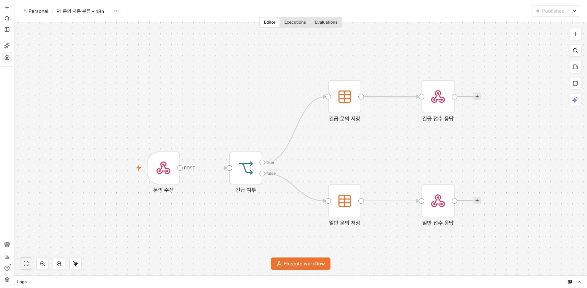
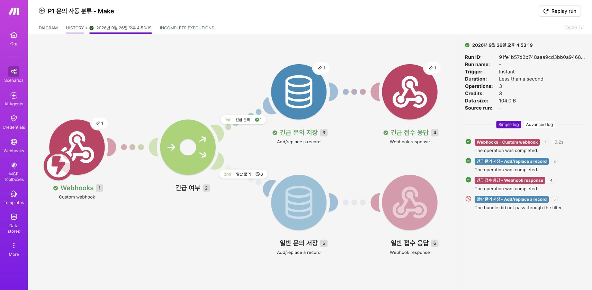
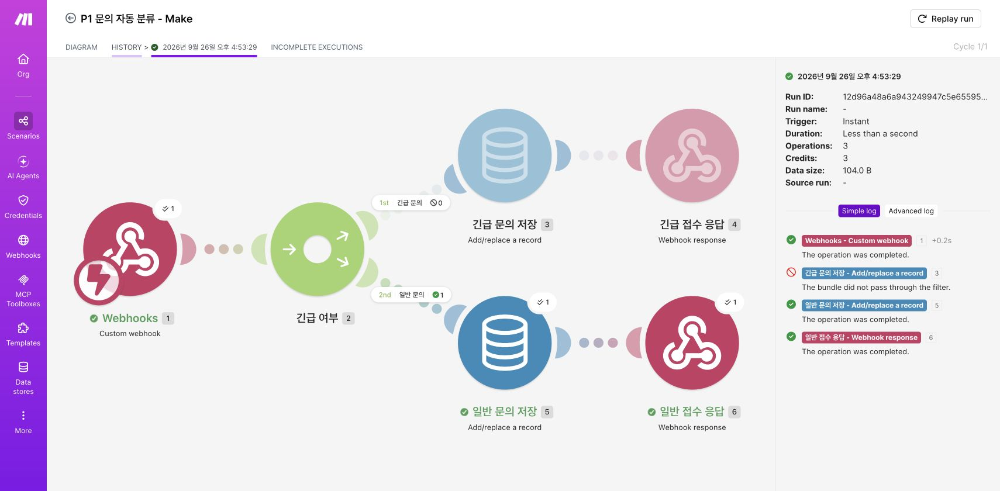
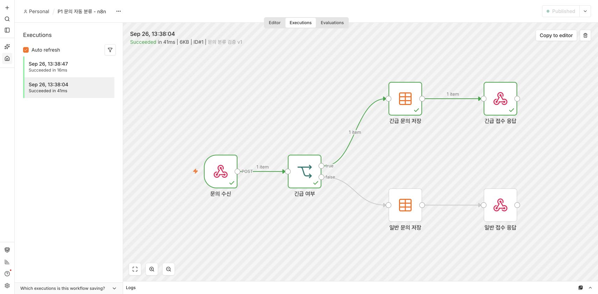
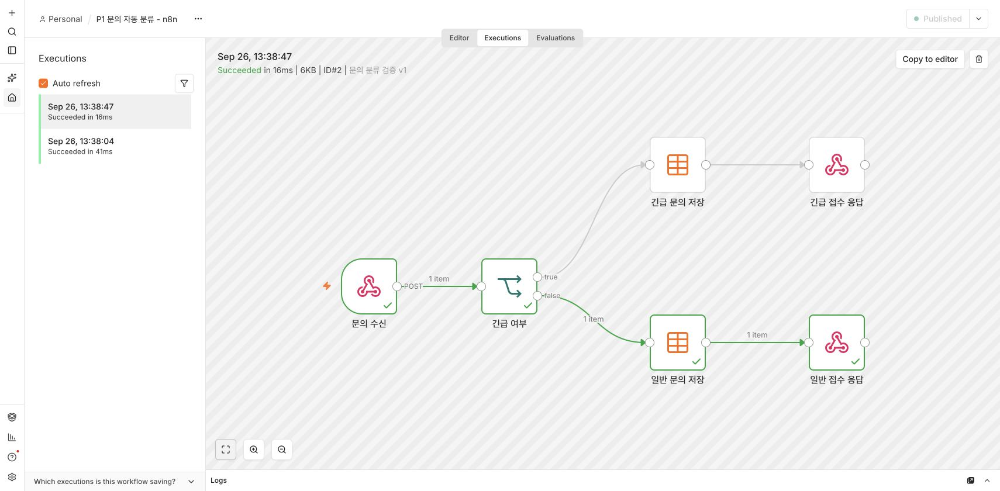
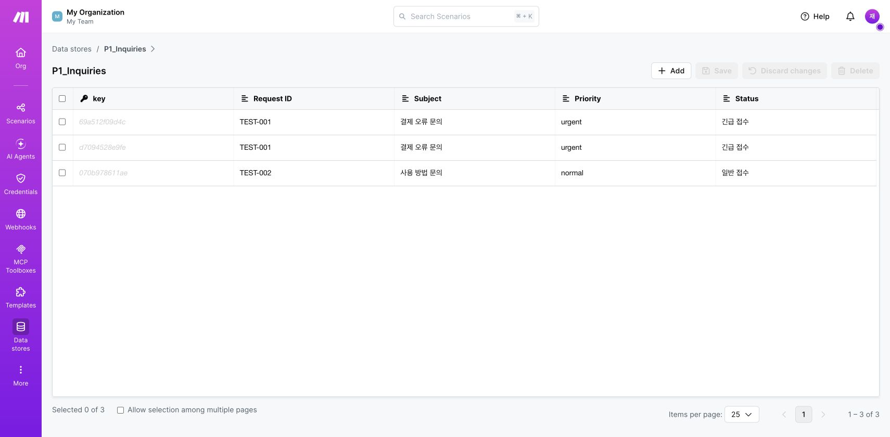
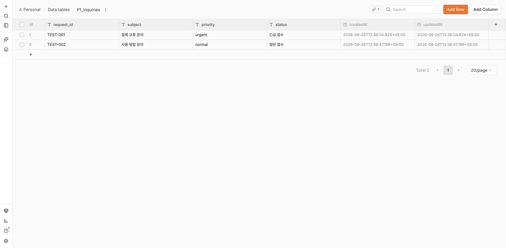
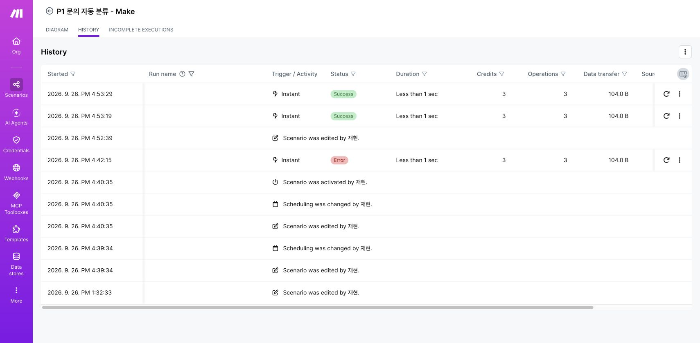

# 프로젝트 1 — 문의 자동 분류: Make와 n8n 비교

작성일: 2026년 9월 26일 · 구현 도구: Make Free, n8n 2.40.7 자가호스팅

## 1. 자동화할 업무와 공통 설계

새 문의를 확인하고 긴급 여부를 판단해 기록한 다음 접수 결과를 회신하는 반복 업무를 자동화했다. 두 도구에 동일한 JSON을 보내고, 같은 조건·저장 필드·응답 형식을 적용했다. 데이터는 과제용 가상 문의이며 실제 고객 정보가 아니다.

**공통 흐름:** POST Webhook 수신 → `priority`가 `urgent`인지 판단 → 해당 분기에서 문의 저장 → HTTP 200 JSON 응답.

| 구성 | Make | n8n |
|---|---|---|
| Trigger 1개 | Webhooks / Custom webhook | Webhook |
| 조건 분기 | Router + 경로별 Filter | IF의 true / false |
| 긴급 조건 | priority = urgent | priority = urgent |
| 일반 조건 | priority ≠ urgent | 위 조건의 false |
| Action 1 | Data store / Add or replace a record | Data table / Insert |
| Action 2 | Webhooks / Webhook response | Respond to Webhook |
| 저장 필드 | request_id, subject, priority, status | 동일 |
| 실행 구조 | 데이터 도착 즉시, 활성화 | 게시된 Production Webhook |

각 분기에 저장과 응답이라는 **서로 다른 Action 2개**가 있다. Router/IF는 처리 대상을 구분하는 제어 단계다. Webhook 응답은 요청한 클라이언트에 결과를 반환하며, 이메일이나 팀 채널 메시지를 보내는 동작은 아니다.

Trigger는 자동화를 시작시키는 이벤트다. 이번 실험에서는 HTTP 요청 도착이 Trigger다. Action은 이벤트 이후 수행하는 작업으로, 기록 저장과 응답 반환이 해당한다. Filter는 조건을 만족한 데이터만 통과시키고, Router는 여러 경로를 제공한다. Make의 각 경로 조건을 서로 반대로 설정해 한 문의가 두 경로에 동시에 들어가지 않도록 했다. n8n의 IF는 true와 false로 자동 분리한다.

## 2. 구현 과정

### Make

1. Custom webhook을 생성하고 샘플 JSON을 전달해 입력 구조를 인식시켰다.
2. `P1_Inquiries` Data store와 네 개의 문자열 필드를 만들었다.
3. Router의 두 경로에 `urgent` 일치/불일치 조건을 지정했다.
4. 각 경로에 저장 모듈과 응답 모듈을 연결했다. 저장 키는 자동 생성하며 덮어쓰기는 사용하지 않았다.
5. 문자열을 `escapeJSON()`으로 이스케이프한 JSON 응답을 구성했다.
6. 시나리오를 저장하고 `Immediately as data arrives`로 활성화한 뒤 실제 요청을 보냈다.


### n8n

1. 공식 npm 패키지로 n8n을 로컬에 설치하고 소유자 계정을 설정했다.
2. 같은 필드를 가진 `P1_Inquiries` Data table을 만들었다.
3. Webhook → IF → 분기별 Insert → Respond to Webhook을 연결했다.
4. 필드 매핑을 지정하고 워크플로우를 게시했다.
5. 테스트용 대기 주소가 아닌 Production Webhook에 실제 요청을 보냈다.



반복 설정을 정확하게 구성하기 위해 JSON 설계도와 n8n 가져오기 기능을 사용했다. 실제 실행 흐름은 두 도구의 기본 노드와 필드 표현식으로 구성했으며 Code 노드를 사용하지 않았다.

## 3. 실행 검증

| 테스트 | 공통 입력 | 기대 결과 | Make 실제 결과 | n8n 실제 결과 |
|---|---|---|---|---|
| TEST-001 | 결제 오류 문의 / urgent | 긴급 접수 | 16:53:19 성공, 긴급 저장·응답 실행 | 13:38:04 성공, 실행 #1 |
| TEST-002 | 사용 방법 문의 / normal | 일반 접수 | 16:53:29 성공, 일반 저장·응답 실행 | 13:38:47 성공, 실행 #2 |

시간은 2026-09-26 한국 시간이다. 두 도구가 반환한 JSON 2쌍을 파싱해 비교했고 각각 일치했다. 실제 응답 내용은 아래 JSON에 제시했다.

긴급 응답:

```json
{"request_id":"TEST-001","subject":"결제 오류 문의","priority":"urgent","status":"긴급 접수"}
```

일반 응답:

```json
{"request_id":"TEST-002","subject":"사용 방법 문의","priority":"normal","status":"일반 접수"}
```

### Make의 각 분기 실행





### n8n의 각 분기 실행





### 저장 결과





Make의 최초 실행(16:42:15)에서는 저장 후 응답의 `toJSON` 함수가 지원되지 않아 실패했다. 실행 로그에서 원인을 확인하고 `escapeJSON`으로 수정한 다음 두 분기를 다시 실행해 성공했다. 따라서 Make 저장소에는 실패 시점에 이미 저장된 TEST-001 한 건이 추가로 남아 총 3건이다. n8n은 최종 검증 요청 2건이 저장되어 있다. 기존 실패 기록을 성공으로 간주하지 않았다.



## 4. 도구 비교

| 비교 항목 | Make | n8n 자가호스팅 | 이번 구현에서의 판단 |
|---|---|---|---|
| UI/UX | 원형 모듈과 Router 경로를 캔버스에 표시 | 노드의 입력·출력과 true/false 연결을 표시 | 둘 다 분기 구조를 시각적으로 설명하기 쉽다 |
| 시작·설정 난이도 | 웹 계정에서 바로 작업 | 설치, 서버 실행, 계정 설정 필요 | 이번 과제에서는 Make의 시작이 더 간단했다 |
| 조건 분기 | Router 뒤 각 경로에 Filter 지정 | IF 하나에 조건을 넣어 두 출력으로 분리 | 이진 분기는 n8n이 간결했고, Make는 경로별 조건 확인이 필요했다 |
| 필드 매핑 | 모듈 번호 기반 매핑과 Make 함수 | 현재 항목의 필드와 표현식 사용 | 함수 문법을 도구 간에 그대로 복사할 수 없다 |
| 연동·저장 | 이번에는 Webhook과 Data store 사용 | 이번에는 Webhook과 Data table 사용 | 외부 계정 연결 없이 두 도구 모두 과제를 완성했다. 다른 서비스 커넥터의 실제 동작까지 검증한 것은 아니다 |
| 실행 로그 | History에 단계 성공·필터 차단·Credits 표시 | Executions에서 성공 여부·노드별 항목 수 확인 | Make에서는 응답 오류의 모듈과 원인을, n8n에서는 통과 경로와 항목 수를 확인했다 |
| 무료 범위·비용 | 공식 Free 플랜 월 1,000 credits. 이번 정상 실행은 건당 3 credits 표시 | Community Edition을 로컬 실행. 이번 구현은 유료 라이선스·클라우드 결제 없이 사용 | Make는 사용량을, n8n은 PC 자원과 운영을 관리해야 한다 |
| 자동 실행 운영 | 클라우드에서 즉시 수신 | 이 PC의 n8n 프로세스가 켜져 있어야 수신 | 항상 실행되는 외부 접수는 Make 운영이 편리하다 |
| 데이터 위치 | Make 계정의 저장소 | 로컬 n8n 데이터 폴더 | 데이터를 로컬에 유지하려면 n8n이 적합하다 |
| 이동·재사용 | Blueprint 내보내기/가져오기 | Workflow JSON 내보내기/가져오기 | 파일만 옮겨도 계정별 Webhook·표 연결은 다시 지정해야 한다 |

무료 범위는 2026-09-26 확인 기준이다. Make의 과금 단위는 현재 **credits**이며 과제 예시의 과거 Operations 표기를 그대로 사용하지 않았다. [Make 공식 요금](https://www.make.com/en/pricing), [Make credits 설명](https://help.make.com/credits), [n8n Community Edition 안내](https://n8n.io/pricing/).

### 장점·단점과 적합한 상황

**Make 장점:** 설치 없이 빠르게 시작할 수 있고 웹훅 운영을 클라우드가 담당한다. 실행 로그에 단계별 결과와 사용량이 함께 보인다. **단점:** 사용량을 관리해야 하며, 여러 경로의 필터를 직접 맞춰야 한다. 이번처럼 짧은 기한 안에 외부 요청을 받는 업무나 서버 관리가 어려운 팀에 적합하다.

**n8n 장점:** 로컬 표, 조건 분기, 예약 실행을 같은 환경에서 구성할 수 있다. 실행별 데이터 흐름을 확인하기 쉽고 워크플로우 JSON을 보관하기 편리하다. **단점:** 설치와 실행 환경 관리가 필요하며, PC 종료·절전 시 로컬 자동화가 멈춘다. 외부 서비스에서 localhost로 직접 접근할 수도 없다. 로컬 데이터 처리나 실행 환경을 직접 관리할 수 있는 업무에 적합하다.

## 5. 한계와 개선점

입력 검증과 중복 방지는 이번 필수 구현의 범위에 포함하지 않았다. `urgent`가 아닌 값은 모두 일반 분기로 들어가므로 실제 운영에서는 허용값 검사와 잘못된 입력 응답을 추가하는 것이 좋다. 문의 ID 기반 중복 검사를 추가하면 재전송 시 중복 저장을 방지할 수 있다. 저장은 성공하고 응답만 실패할 수 있다는 점도 이번 오류에서 확인했다.

API Key·비밀번호·토큰은 제출물에 넣지 않았고, Make Webhook의 실제 URL도 제외했다. 테스트 데이터만 사용했다. AI Action과 실패 알림 보너스는 구현하지 않았다.
