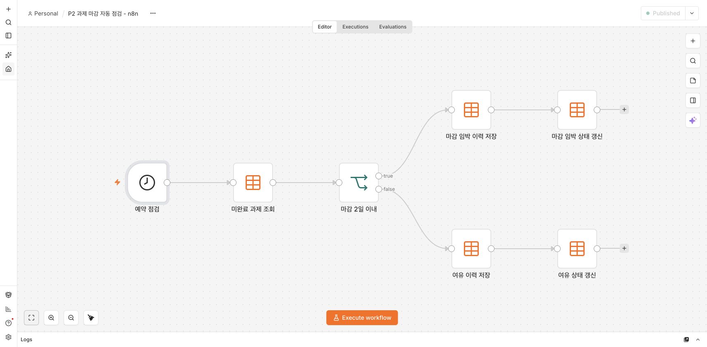
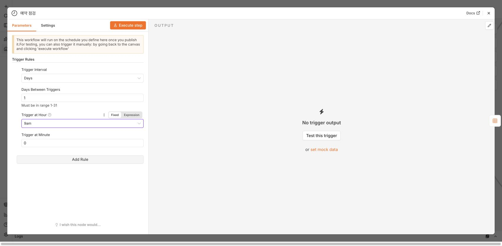
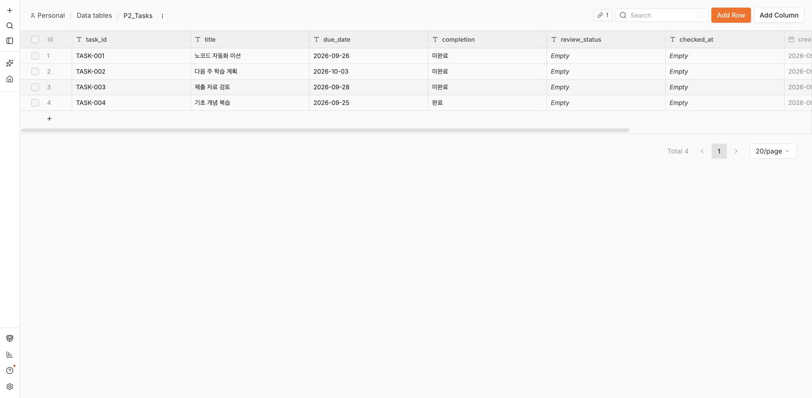
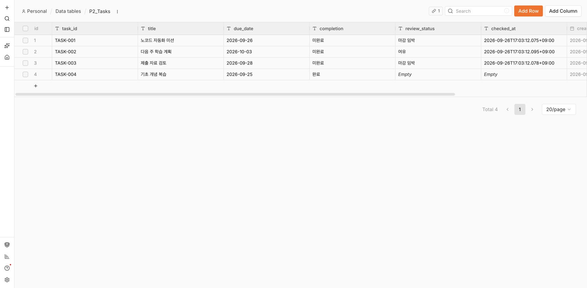
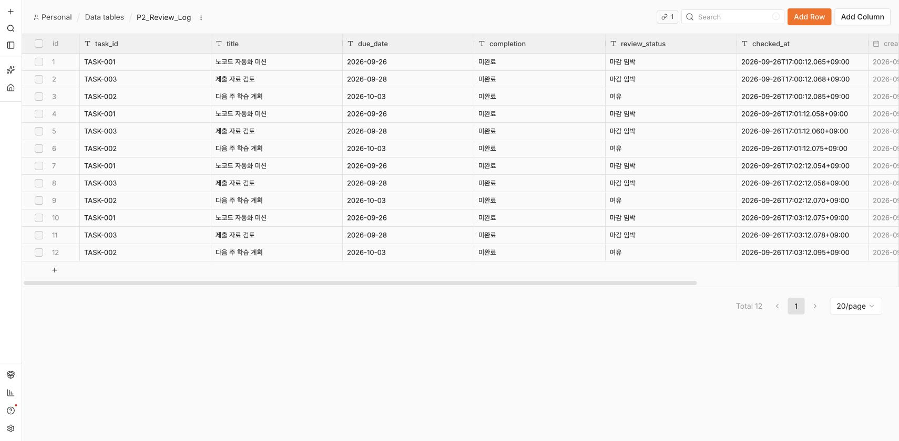

# 프로젝트 2 — 과제 마감 자동 점검

작성일: 2026년 9월 26일 · 선정 도구: n8n 2.40.7 자가호스팅

## 1. 반복 업무와 도구 선정

매일 과제 목록에서 미완료 항목을 찾고, 마감까지 남은 날짜를 계산해 우선순위를 표시하고, 확인한 이력을 남기는 일을 자동화했다. 데이터는 과제용 예시 4건이다.

n8n을 선택한 이유는 예약 Trigger, IF 분기, 내장 Data table의 조회·추가·수정을 하나의 흐름으로 구성할 수 있기 때문이다. 이미 설치한 환경을 재사용했고 별도 유료 기능이나 외부 계정 인증 없이 구현했다. Google Sheets 연결도 시도했지만 인증 대기 문제가 있어, 최종 구현과 실행 증거는 **n8n 내장 표를 기준**으로 한다. Google Sheets 초안은 자동화의 실제 결과로 제출하지 않는다.

## 2. 워크플로우 설계

**최종 자동 실행 시간:** 매일 오전 9시, 시간대 `Asia/Seoul`. 게시 상태로 유지했다.

1. **Trigger — 예약 점검:** Schedule Trigger가 정해진 시간에 실행한다.
2. **조회 — 미완료 과제 조회:** `P2_Tasks`에서 `completion = 미완료`인 행만 가져온다.
3. **조건 분기 — 마감 2일 이내:** 마감일과 한국 시간 기준 오늘 0시의 차이를 계산한다. 남은 날짜가 2 이하이면 true, 2 초과이면 false다. 이미 지났지만 미완료인 과제도 true로 분류한다.
4. **true 경로 Action 1:** `P2_Review_Log`에 `마감 임박` 분류와 점검 시각을 기록한다.
5. **true 경로 Action 2:** 해당 `task_id`의 원본 과제에 분류와 점검 시각을 갱신한다.
6. **false 경로 Action 1:** 같은 이력 표에 `여유` 분류와 점검 시각을 기록한다.
7. **false 경로 Action 2:** 해당 원본 과제에 `여유`와 점검 시각을 갱신한다.

각 경로가 이력 추가와 원본 갱신의 Action 2개를 수행한다. 원본의 과제명, 마감일, 완료 여부는 갱신 대상에서 제외했다. 여러 과제가 들어오면 각 항목이 자신의 `task_id`로 갱신된다.

조건에 사용한 n8n 필드 표현식:

```text
DateTime.fromISO($json.due_date).diff($today, "days").days <= 2
```

날짜는 `YYYY-MM-DD` 형식을 사용한다. Code 노드 없이 기본 노드와 필드 표현식으로 구성했다. 잘못된 날짜나 빈 날짜를 처리하는 별도 경로는 추가하지 않았으므로 유효한 날짜를 입력해야 한다.





## 3. 데이터 구조

두 표는 다음 사용자 필드와 n8n의 자동 ID·생성/수정 시각 필드를 가진다.

| 필드 | 용도 |
|---|---|
| task_id | 과제 식별자, 원본 갱신 시 일치 조건 |
| title | 과제명 |
| due_date | 마감일, YYYY-MM-DD 문자열 |
| completion | 미완료 또는 완료 |
| review_status | 마감 임박 또는 여유 |
| checked_at | 실제 점검 시각, 시간대가 포함된 ISO 문자열 |

`P2_Tasks`는 과제별 최신 상태를, `P2_Review_Log`는 실행 때마다 누적되는 이력을 저장한다. 테스트 데이터는 별도 초기 준비 워크플로우로 한 번 입력했다. 운영 자동화는 고정된 예제 목록 대신 실제 원본 표를 조회한다.



## 4. 실제 자동 실행 검증

테스트 시 Schedule Trigger를 1분 간격으로 게시한 뒤 **Execute workflow 버튼을 누르지 않고** 예약 실행을 기다렸다. 2026-09-26 17:00:12에 실행 #5가 자동으로 시작돼 64ms에 성공했다. 이후 17:01:12, 17:02:12, 17:03:12에도 예약 실행 #6~#8이 성공했다.

검증 후 간격을 매일 오전 9시로 변경하고 `매일 오전 9시 운영 v2`를 게시했다. 최종 내보내기에서도 활성화 상태와 `Asia/Seoul`, 오전 9시 설정을 확인했다. 다음 날 오전 9시 실행 자체를 미리 검증했다고 주장하지 않는다. 자동 시작은 1분 간격의 검증 버전에서 확인했다.

| 입력 | 마감일 | 완료 상태 | 기대 경로 | 실제 결과 |
|---|---|---|---|---|
| TASK-001 노코드 자동화 미션 | 2026-09-26 | 미완료 | true, 오늘 마감 | 마감 임박 이력 저장 + 원본 갱신 |
| TASK-002 다음 주 학습 계획 | 2026-10-03 | 미완료 | false, 7일 후 | 여유 이력 저장 + 원본 갱신 |
| TASK-003 제출 자료 검토 | 2026-09-28 | 미완료 | true, 2일 경계 포함 | 마감 임박 이력 저장 + 원본 갱신 |
| TASK-004 기초 개념 복습 | 2026-09-25 | 완료 | 조회 단계에서 제외 | 점검 상태·시각이 빈 상태 유지 |

실행 #5의 조회 출력은 **3개**, true 경로는 **2개**, false 경로는 **1개**다. 각 분기의 이력 저장과 상태 갱신까지 성공했다.






예약 검증이 총 4회 실행되었으므로 이력은 총 12건이다. 이는 같은 실행이 중복 저장된 것이 아니라 각 예약 실행에서 미완료 3건을 다시 점검한 결과다. 원본에는 가장 최근 17:03:12의 점검 결과가 남는다.

## 5. 운영 방법과 한계

`P2_Tasks`에서 새로운 과제를 추가하거나 완료 여부를 수정하면 다음 예약 실행에서 반영된다. `task_id`는 중복되지 않게 작성하고, `completion`은 정확히 `미완료` 또는 `완료`로 입력한다. 과제 날짜가 잘못되면 날짜 계산이 불가능하므로 입력을 먼저 확인한다.

로컬 n8n 서버와 PC가 실행 중이어야 예약 작업이 동작한다. PC 종료·절전으로 놓친 예약을 자동 소급 실행하는 기능은 구현하지 않았다. 계속 운영하려면 항상 켜진 서버로 이전하는 것이 적합하다. 업무 처리 전체에 대한 원자적 트랜잭션이나 중복 방지, 오류 알림, 자동 재시도도 이번 구현에는 포함하지 않았다. AI·실패 알림 보너스는 미구현이다.

Schedule Trigger는 게시와 시간대 설정이 필요하다는 공식 안내를 확인했다. [n8n Schedule Trigger 문서](https://docs.n8n.io/integrations/builtin/core-nodes/n8n-nodes-base.scheduletrigger/).

## 6. 요구사항 확인

| 요구사항 | 충족 증거 |
|---|---|
| 반복 업무 1개 정의 | 매일 미완료 과제 마감 점검 |
| 도구 선정 및 이유 | 내장 표·예약·분기를 지원하는 n8n 선택 |
| Trigger 1개 이상 | Schedule Trigger |
| Action 2개 이상 | 각 경로의 이력 Insert + 원본 Update |
| 조건 분기 1개 이상 | 마감 2일 이내 IF |
| 모든 분기 실제 실행 | 실행 #5 true 2개 / false 1개 |
| 자동 실행 | 게시 후 1분 간격으로 실행 #5~#8 자동 시작 |
| 구현·결과 캡처 | 본 문서에 원본 스크린샷 포함 |
